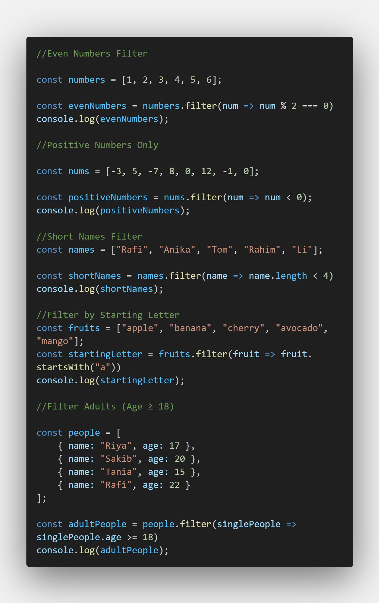
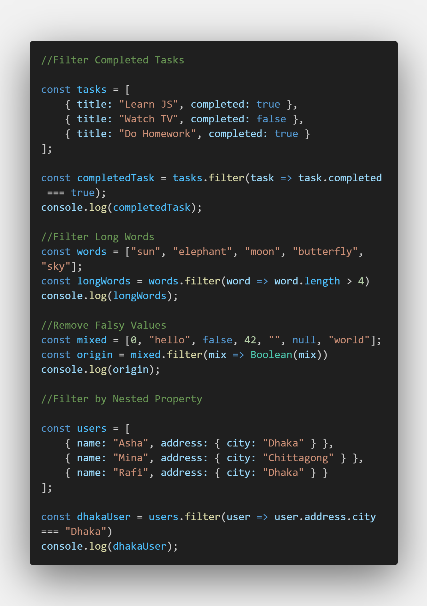
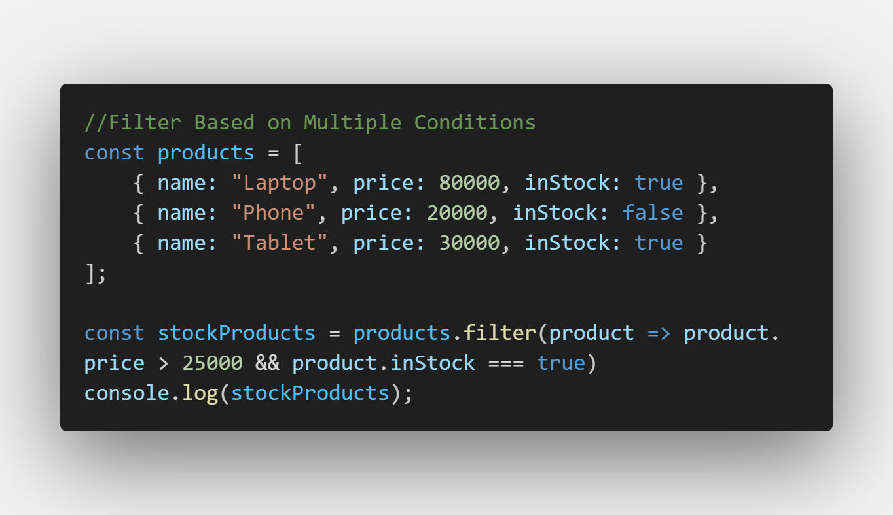

🧩 JavaScript Filter Method Practice

This project contains 10 different problems solved using the JavaScript filter() method.
Each problem focuses on understanding how to use filter() for real-world use cases like arrays, objects, nested data, and logical conditions.

✅ What I’ve Done

1. Even Numbers Filter – kept only even numbers from an array.

2. Positive Numbers Only – filtered out negative numbers, keeping only positive and zero.

3. Short Names Filter – kept names that have 4 or more characters.

4. Filter by Starting Letter – selected all fruits that start with the letter “a”.

5. Filter Adults (Age ≥ 18) – extracted only adult people based on age.

6. Filter Completed Tasks – displayed only completed tasks from a list.

7. Filter Long Words – kept words longer than 4 characters.

8. Remove Falsy Values – removed all falsy values like 0, false, "", and null.

9. Filter by Nested Property – selected only users who live in Dhaka.

10. Filter Based on Multiple Conditions – kept products that are in stock and price > 25,000.

